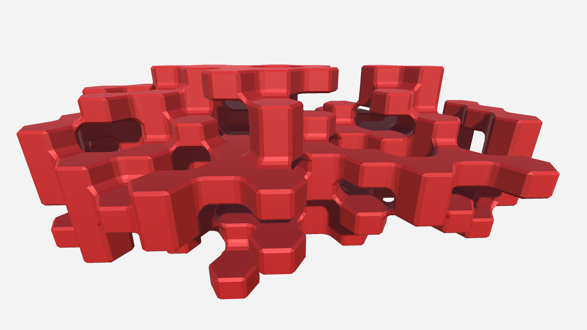
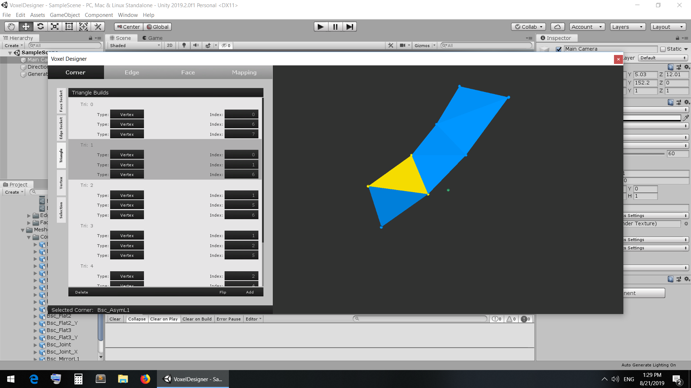

# VoxelDesigner

This is a Unity project I created to help me design hexagon voxels and assign them to certain patterns in a Unity Editor window and then use those designs to assemble a mesh. It is a work in progress so be aware things may be difficult to understand and some feature that appear there are missing entirely but I am working on implementing them in the future.

## Main Idea

The main idea behind this project is I want to design hexagon shaped voxels. What I mean by designing voxels is that I want to hand make little meshes and add them to the whole mesh based on rules then link them together to form whole voxels for many voxels in a terrain map. Why would I want to do that? I want to do this because by making the mesh this way you can have a lot of control over how the mesh looks and the interaction between the voxels. I also want to do this because then when you want to change the look of your voxel mesh you can redesign it without ever going back into the code which can reduce errors cropping up. I use a simple abstraction to break the voxels up into base parts or components, design those individual elements, describe how they should connect to other elements and then map them to patterns that get matched when constructing the mesh.

## Voxel Component Abstraction

The current abstraction I am using for this project is that a voxel is comprised of 3 parts just like a mesh: Corners, Edges, and Faces. The order is important as well because in this order the mesh can be built up and linked very easily. The space is broken up into fixed anchor points for each component, these points act as the origin of the component when constructing its mesh and can be referenced by a unique key making lookup tables easy to implement. This is like an invisible hexagon lattice with points at line intersections, line middle points and hexagon middle points. Corners are laid out first, they have 6 voxels around them and at any time have 5 edges that can connect to them and possibly 15 places for faces to connect to them. Edges are laid out next and are only formed between the corners we already laid out, depending on whether it is a vertical or horizontal edge it will have 3 or 4 surrounding voxels to consider respectively. Edges have 4 places that faces can connect to and connect to 2 corners. Faces are laid out last and can only be formed from either 6 corners and 6 edges or 4 corners and 4 edges although currently this isn't very strict and you only need the corner requirements. They can plug into both corners and edges but the plugging of faces into edges is not implmented yet. Faces also have only 2 voxels that surround them.

Each component has the possibility of contributing vertices and triangles to the mesh but don't have to, it depends on the design. There are things called "Edge Sockets" and "Face Sockets" that lower level components like corners and edges have that let higher level components access vertices of the component to use in their mesh construction. There are also "Corner Plugs" and "Edge Plugs" which are related and perform the inverse function of letting the current component know it will be plugging into a lower level component with a certain amount of vertex sharing that can be assumed and used in construction of mesh triangles.

## Current and Future Features

Currently there are several features that are implemented with many I intend to iterate on and add.

### Current Features:
* Interface and work with voxel components and mapping objects easily using a dedicated editor window.
* Design corners, edge and faces that can be rotated to match their pattern.
* Flat shading enabled by preventing triangle vertex sharing. Adds more geometry to the mesh but that is how Unity does it.
* Create and edit corner, edge and face objects and save them to your project folder as assets.
* Create and edit mapping objects to map patterns to voxel components.
* Mapping objects can be swapped easily to generate a mesh for a voxel terrain in a completely new style.

### Features Being Worked On:
* Design preview panel. Right now when you are designing the components you cannot see what they look like and have to use your imagination and know what is happening. This has very nasty consqeunces for current and future additions so I am making this one of my top priorities as it is stalling the publishing of the next feature.
* Importing vertices and triangles from .obj files so they can be designed and made in Blender then exported where they can be imported using the voxel designer window to be used. This is currently working on my end but isn't very useable until I can get the preview panel working.
* Adding more code commenting and documentation. I initially underestimated how many script files their were and will be getting to rectifying this issue going forward in piece meal.

### Future Features:
* Updating the window UI to better reflect spatially some of the pattern matching as it is currently confusing.
* Adding the possibility of patterns to be flipped vertically because currently patterns match horizontally only and this means you have to make a vertically flipped version of every corner if you want it to be flipped with its pattern.
* Improving the voxel mesh data class so voxels can be added and not drawn. This is desired because I want to be able to use this class to make mesh chunks and that means meshes need to have their seams stitched. I plan on accomplishing that easily by having added voxels influence the mesh but not get added such as contributing neighbouring normals.
* Calculate normals of a mesh. This is so I can again stitch mesh seams properly.
* LOD groups for components or LOD versions of mapping objects. Technically this can already be done by redoing the components and assigning them similarly in a new mapping object but it would be better if this kind of thing was supported and made easier as part of the components or something.
* More to come...
